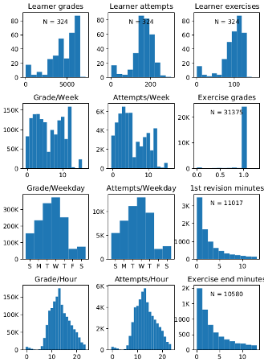
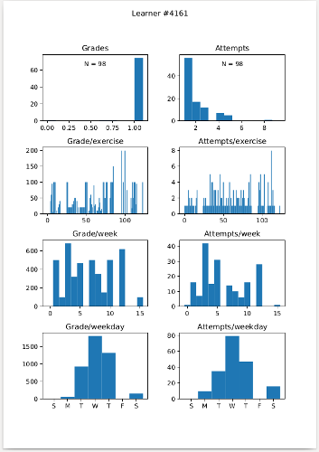
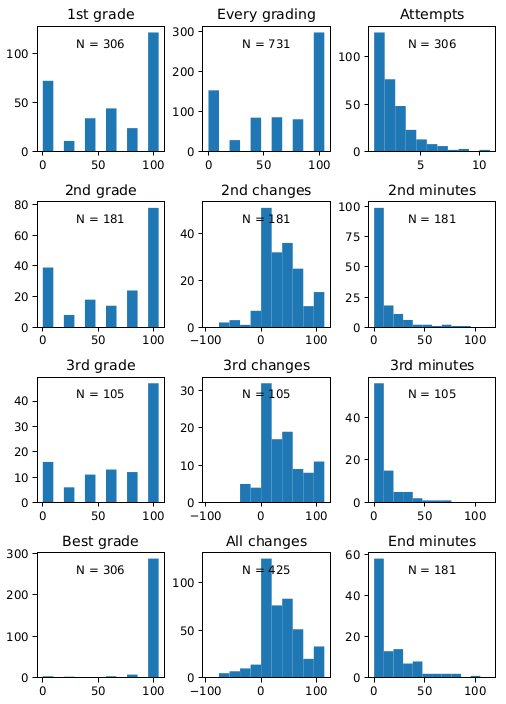

# Llama CLI

A utility program that fetches and preprocesses learning data from supported learning
tools. Educators and researches have important usecases for accessing the raw data
that is generated while learners are using digital learning tools and environments.
These stakeholders can aim to e.g. analyse and improve teaching materials, methods,
and activities.

The aim of Llama CLI is to support and ease the steps of
1. connecting to the supported learning data sources
2. excluding persons and unwanted data tables or columns
3. fetching partial and complete data sets
4. anonymizing data before research activities
5. standardizing/transforming/sharing data
6. sampling and selecting data for analysis/ML

Currently supported data sources are
* A-plus https://apluslms.github.io/
* *TODO* Acos
* *TODO* Iwdap (course system prototype)

## Etymology

The name for the project comes from ~ la lumière à Montagne analytique. Pardon my French for ~ light on the mountain of analytics. Also LA is an acronym, that the
package author may have used in his thesis more than a decent number of times,
and that stands for Learning Analytics which is a research field in education
technologies. Llamas are also known from a controversial programming exercise for
computer science majors at Aalto University.

## Installation

Llama CLI is available at PyPI. It has a number of automatically installed
dependencies, most notably `pandas`, `numpy`, `scipy`, and `requests`.

      % python3 -m pip install llama-cli
      % llama

OR contained in a virtual environment (directory)

      % python3 -m venv .venv && .venv/bin/pip install llama-cli
      % .venv/bin/llama

## Instructions

Llama CLI operates on the current working directory. The configurations and data
will be stored in that directory – little bit like when working with git repositories.
One work directory can connect with multiple data sources and one should select
the sources that the current research or analysis project requires.

      % llama
      Llama CLI fetches and preprocesses learning data

      usage: llama <cmd> [<args>]

         status      Show the working tree status
         source      Manage sources for learning data
         list        List available data tables and columns
         privacy     Configure privacy (default: pseudoanonymous)
         exclude     Exclude selected tables, columns, or persons at fetch
         fetch       Fetch data from sources
         anonymize   Export anonymized data
         shell       Open python REPL with 'llama' instance for exported data

1. Use `llama source add` to interactively connect with data sources.
   The required addresses and keys will be prompted when required.
2. Use `llama list` to fetch the available data tables.
3. Time to consider excluding some uninteresting data or persons who have
   not consent to the research at hand. See `llama exclude` for examples.
4. Use `llama fetch rows` to download data tables. Depending on the project
   it may be necessary to also `llama fetch files` and/or `llama fetch meta`.
   This step has a delay between internet requests and it may take a long time
   to complete. The rows can be fetched again to append new data if supported
   by the data source.
5. The data in `fetched` directory is pseudoanonymized by default.
   The pseudo identifiers are required to complete fetching of depended data.
   With access to the source database the pseudo identifiers can be traced to persons.
   Use `llama anonymize` to produce `export` directory that can be e.g. stored in
   research repository, when the security measures and research consent allow it.

## Output & Research

The raw CSV and other files are available in the `export` directory. However,
the package also offers a Python interface for programmatic accessors and samplers
of the exported data. Exports can be opened both in an interactive test via
`llama shell` or using following constructor in a program or e.g. Jupyter notebook.

      from llama import LlamaApi, LlamaStats
      llama = LlamaApi('export')

API documentation:

> This README documents the `LlamaApi` that in addition to selecting data,
> offers quick output from statistical methods in `LlamaStats`. When the return
> values are needed for further processing, the `LlamaStats` must be used directly.

### `llama = LlamaApi(*directories)`

Constructs a standard interface to work with one or multiple Llama export directories.
If no directory parameters are given the constructor seeks `./export` directory.
* `*directories: str` (optional 0-N paramaters) Llama export directory paths
* **Returns** an instance of `LlamaApi`

### `llama.list(select)`

Lists sources and tables from the data. Subset of data can be selected with
the optional select dictionary.
* `select: dict OR dict[]` (optional) including following keys
  * `source: int` (optional) index of a learning data source
  * `table: str` (optional) text to match table name (or id)
  * `table_by_id: bool` (optional) True to match `table` with table id
  * `reverse: bool` (optional) True to exclude matches and include rest

### `llama.get(select)`

Reads and iterates over data form tables. This method can be combined with
many methods from `LlamaStats`.
* `select: dict` (optional) see `llama.list`
* **Returns** `iterator` over `tuples` of
  `(source: dict, table: dict, rows: pandas.DataFrame)`

### `llama.overall_description(select)`

Calculates statistical grade and attempt distributions,
as well as weekly and daily patterns.
* `select: dict` (optional) see `llama.list`

### `llama.overall_pdf(select, pdf_name)`

Renders a page about overall statistics.
* `select: dict` (optional) see `llama.list`
* `pdf_name: str` (optional) a file name for pdf output, else try to plot to window

### `llama.learner_description(persons, select)`

Calculates statistical grade and attempt distributions,
as well as weekly and daily patterns for the learners.
* `persons: list` (optional) a list of persons numbers to include
* `select: dict` (optional) see `llama.list`

### `llama.learner_pdf(persons, select, pdf_name)`

Renders a statistic page for each learner.
* `persons: list` (optional) a list of persons numbers to include
* `select: dict` (optional) see `llama.list`
* `pdf_name: str` (optional) a file name for pdf output, else try to plot to window

### `llama.execise_description(select)`

Calculates statistical distributions for each selected exercise table.
* `select: dict` (optional) see `llama.list`

### `llama.exercise_pdf(select, pdf_name)`

Renders a statistic page for each exercise.
* `select: dict` (optional) see `llama.list`
* `pdf_name: str` (optional) a file name for pdf output, else try to plot to window

